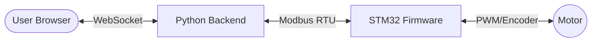

# PickPlace Robot - Circular Picking System

A complete software and firmware stack for the FRA502 Circular Pick and Place Robot. This project enables precision motor control, trajectory generation, and a modern web interface for remote operation.

---

## 🏗️ System Architecture

The project is divided into two main components that communicate via Modbus RTU:

1.  **[Base System](./Base_System/README.md):** The high-level control layer.
    *   **Frontend:** A modern Web UI (React/Nginx) running in Docker.
    *   **Backend:** A Python-based WebSocket server that bridges the Web UI to the hardware.
2.  **[STM32 Firmware](./Firmware/STM32_Firmware/README.md):** The low-level execution layer.
    *   Runs on an STM32G474RE (Nucleo).
    *   Implements dual-loop PID control, S-Curve trajectory generation, and safety protocols.



---

## 📂 Repository Structure

```text
PickPlace_Robot/
├── Base_System/           # High-level software (Web UI & Python Bridge)
│   ├── backend/           # Python source code
│   ├── start_*.sh         # One-click deployment scripts
│   └── README.md          # Setup instructions for the UI
└── Firmware/              # Embedded code
    ├── STM32_Firmware/    # Primary motor control firmware (CubeIDE)
    │   ├── Src/ & Inc/    # C source and header files
    │   └── README.md      # Pinout and hardware setup
    └── Arduino/           # (Optional) Alternative ESP32 implementations
```

---

## 🚀 Quick Start Guide

To get the full system running, follow these three stages:

### Stage 1: Flash Firmware
1. Open **STM32CubeIDE** and import `Firmware/STM32_Firmware`.
2. Build and flash the code to your **Nucleo-G474RE** board.
3. Keep the board connected to your computer via USB.

### Stage 2: Load Web Image (First time only)
Open your terminal in the `Base_System` directory and run:
```bash
docker load -i frontend-image.tar
```

### Stage 3: Launch the System
Run the script matching your operating system inside the `Base_System` folder:
*   **macOS:** `./start_mac.command`
*   **Windows:** `start_windows.bat`
*   **Linux:** `./start_linux.sh`

The Web UI will automatically open at **http://localhost:3000**.

---

## 🛠️ Key Technologies

*   **Languages:** C (Firmware), Python (Backend), TypeScript (Frontend).
*   **Communication:** Modbus RTU (Serial), WebSockets (Real-time data).
*   **DevOps:** Docker (Frontend containerization), Bash/Batch (Deployment automation).
*   **Control Theory:** Dual-loop PID, S-Curve Trajectory generation.

---

## 📖 Component Documentation

For detailed technical specifications, pinouts, and troubleshooting, refer to the individual READMEs:
*   [Base System Documentation](./Base_System/README.md)
*   [STM32 Firmware Documentation](./Firmware/STM32_Firmware/README.md)
